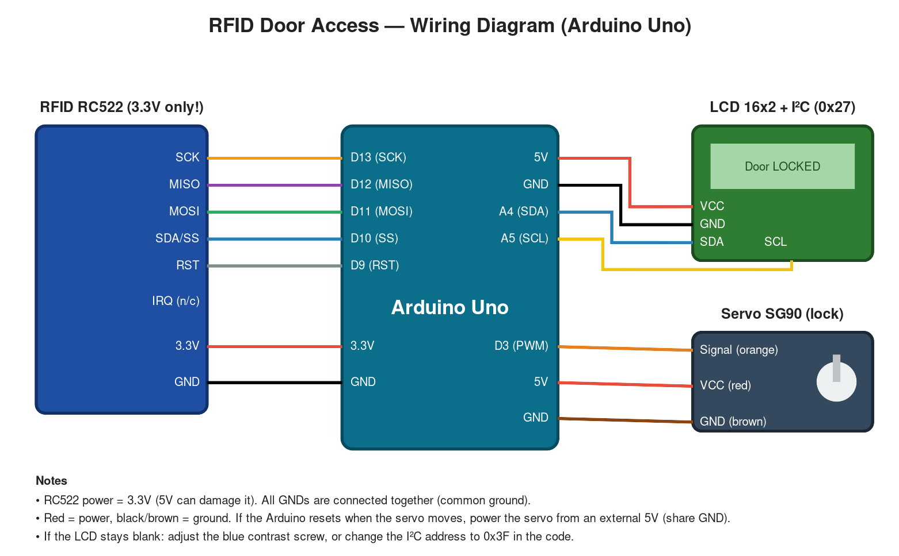

# How to design the circuit (and get a figure)



## Which tool?
| Tool | Has RC522? | Simulates code? | Use it for |
|---|---|---|---|
| **Tinkercad Circuits** (free, browser) | ❌ | ✅ | Practise + simulate **LCD I²C + servo** part |
| **Wokwi** (free, browser) | ❌ | ✅ | Same as Tinkercad, faster, real Arduino libraries |
| **Fritzing** (desktop, ~€8) | ✅ (download part) | ❌ | Pretty breadboard **figure** of the full build |
| `figures/wiring_diagram.svg` (this repo) | ✅ | ❌ | Ready-made full wiring figure for reports |

**Recommendation:** use Tinkercad to *learn and simulate* LCD + servo, use the figure in this repo as the official diagram, and photograph the real breadboard on Day 2.

## Tinkercad step by step (~45 min)
1. Go to tinkercad.com → sign in → **Circuits → Create new Circuit**.
2. Drag in: **Arduino Uno R3**, **Breadboard small**, **LCD 16x2 (I²C)**, **Micro Servo**.
3. Power rails: Arduino **5V → breadboard red (+)**, **GND → blue (−)**.
4. LCD I²C: GND→(−), VCC→(+), SDA→**A4**, SCL→**A5**.
5. Servo: brown→(−), red→(+), orange→**D3**.
6. RC522 stand-in: add a **text note** "RC522: D13 SCK, D12 MISO, D11 MOSI, D10 SS, D9 RST, 3.3V, GND".
7. Colour wires (click wire → colour): red power, black ground, others by signal — same as the figure.
8. **Code → Text**, paste a test sketch (below) → **Start Simulation**. Servo should swing, LCD should show text.
   Tinkercad LCD I²C address is usually **0x20**.
9. Export: **Share → Download image (PNG)** → save as `docs/figures/tinkercad_lcd_servo.png`.

### Tinkercad test sketch (no RFID)
```cpp
#include <Wire.h>
#include <LiquidCrystal_I2C.h>
#include <Servo.h>
LiquidCrystal_I2C lcd(0x20, 16, 2);
Servo s;
void setup() { lcd.init(); lcd.backlight(); s.attach(3); }
void loop() {
  lcd.clear(); lcd.print("Access Granted"); s.write(87); delay(3000);
  lcd.clear(); lcd.print("Door LOCKED");    s.write(0);  delay(3000);
}
```

## Check before moving to real wiring
- [ ] Every module has power + GND
- [ ] RC522 on **3.3V**
- [ ] Pins match `wiring.md` and the code
- [ ] Simulation runs with no red errors
