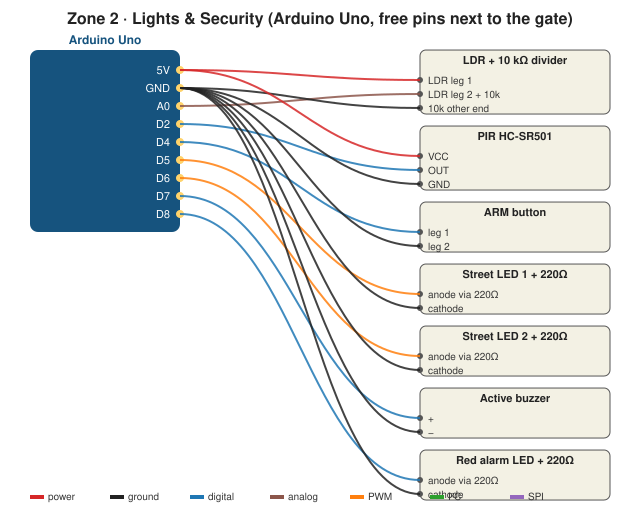

# How to design the circuit (and test it without hardware)

## Which tool?
**Wokwi** has every part in this zone (Uno, photoresistor, PIR, LEDs, buzzer, button, servo, LCD I²C) and runs the real code, so it's the best choice here. Tinkercad works too (it has a photoresistor and PIR). See [../../1_smart_gate/docs/circuit_tools.md](../../1_smart_gate/docs/circuit_tools.md) for more tools.

## Wokwi step by step (~30 min)
1. Go to **wokwi.com → New project → Arduino Uno**.
2. Click **+** and add: Photoresistor sensor module, PIR motion sensor, 3 × LED (2 yellow, 1 red), 3 × resistor (set to 220 Ω), Buzzer, Pushbutton.
3. Wire exactly as in [wiring.md](wiring.md). (Wokwi's photoresistor *module* has an AO pin: connect AO → A0, no extra resistor.)
4. Paste `code/02_street_lights/02_street_lights.ino` → **▶ Start**.
5. Click the photoresistor and drag the **lux** slider: lights should turn on in the dark, and not flicker near the threshold.
6. Paste `code/03_motion_lights` → click the PIR and press **Simulate motion**.
7. Paste `code/04_security_system` → press the button (ARMED), wait 10 s, simulate motion → ALARM.
8. Take a screenshot → save as `docs/figures/wokwi_lights.png`.

> Wokwi's PIR doesn't need the 60 s warm-up. Change `PIR_WARMUP_MS` to `0` while simulating, and back to `60000` on real hardware.

## Check before real wiring
- [ ] Every LED has a 220 Ω resistor
- [ ] Street LEDs are on PWM pins (D5, D6 have a **~** mark)
- [ ] No pin is used twice (compare with the gate's pins)
- [ ] Hysteresis: lights don't flicker in the simulation
