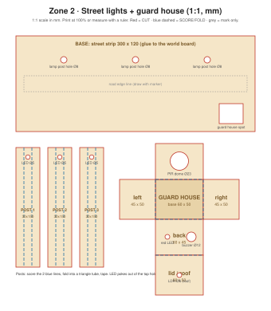

# Cardboard: street lights + guard house

The drawing is 1:1 scale (mm). Print at 100% on A3, or copy the measurements with a ruler.

## Design idea
A street strip that runs from the gate into the world, with **3 lamp posts** and a small **guard house**.
- Lamp posts are triangle tubes: the LED sticks out of the top, wires run down inside.
- The guard house holds the PIR (front, facing the street), the LDR (roof, facing the sky), the red alarm LED and the buzzer.
- Wires go through the base to the Uno hidden behind the gate wall.

## Parts and cut list
| Part | Size (mm) | Qty | Notes |
|---|---|---|---|
| Street base | 300 × 120 | 1 | 3 post holes Ø8 |
| Lamp post strip | 30 × 150 | 3 (2 wired, 1 decoration) | Score 2 lines, fold into a triangle tube |
| Guard house net | 60 × 50 × 45 box + lid | 1 | PIR hole Ø23 front, LDR Ø6 roof |

Single-wall cardboard about 3 mm thick. Tools: ruler, pencil, craft knife, cutting mat, hot glue or tape.

## Build steps
1. **Cut** the base and the 3 post holes.
2. **Posts:** score the 2 blue lines, push an LED (with its 220 Ω resistor already soldered or twisted on) through the top hole, fold into a tube, tape. Push the post into a base hole.
3. **Guard house:** cut the net, cut the PIR, LDR, LED and buzzer holes, fold and tape. Leave the back wall taped only (so you can open it).
4. Mount the **PIR** dome through the front hole, the **LDR** through the roof (legs inside).
5. Run all wires through the base to the Uno.

## Demo checks
- [ ] Covering the guard house roof turns the street lights on
- [ ] Walking past the guard house brightens the lights
- [ ] LDR is not lit by the street LEDs themselves (otherwise the lights switch themselves off!)
- [ ] Nothing hot: LEDs with resistors stay cool
