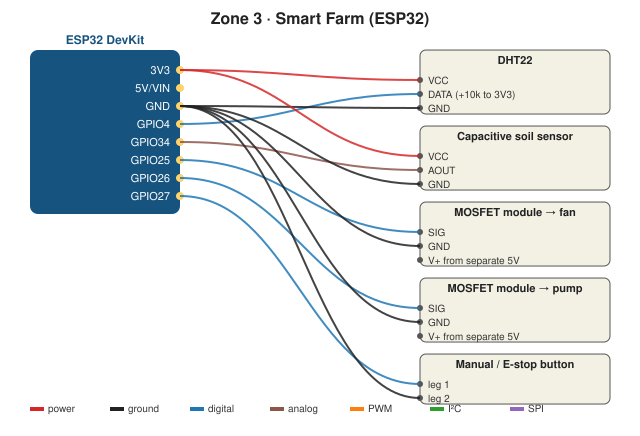

# How to design the circuit (and test it without hardware)

## Which tool?
**Wokwi** simulates the ESP32, the DHT22 and even Wi‑Fi + MQTT, so you can test `03_mqtt_publish` before buying parts.
Wokwi has no soil sensor: use a **potentiometer** on GPIO34 instead (turn it = wetter/drier). Use **LEDs** in place of the fan and pump.

## Wokwi step by step (~40 min)
1. **wokwi.com → New project → ESP32**.
2. Add: DHT22, Potentiometer (soil stand-in), 2 LEDs + 220 Ω (fan, pump stand-ins), Pushbutton.
3. Wire as in [wiring.md](wiring.md), with LEDs on GPIO25 and GPIO26.
4. Paste `code/01_read_sensors` → ▶. Click the DHT22 to change the temperature.
5. For MQTT in Wokwi: in `secrets.h` use `WIFI_SSID "Wokwi-GUEST"`, password `""`, and `MQTT_HOST "test.mosquitto.org"`. Change the topics to something unique, e.g. `bellzum/world/farm/sensors`, because that server is public.
6. Paste `code/04_farm_control` → turn the pot down (dry) → the pump LED should light for 3 s, then not again for 20 min.
7. Screenshot → `docs/figures/wokwi_farm.png`.

## Check before real wiring
- [ ] Nothing 5 V touches an ESP32 pin
- [ ] Fan and pump powered from a separate 5 V supply, GND shared
- [ ] Electronics are higher than and away from the water
- [ ] Pump can't run more than 3 s (watch the LED in Wokwi)
