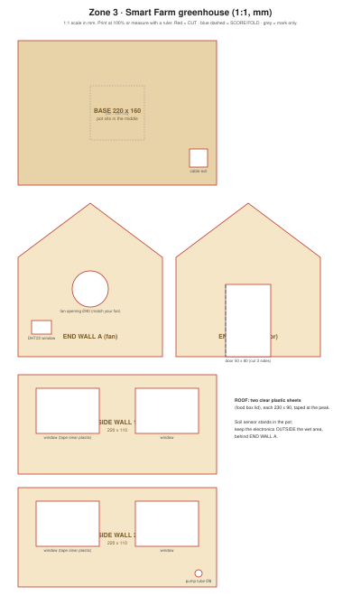

# Cardboard: greenhouse

1:1 scale (mm). Print at 100% on A3, or copy the measurements.

## Design idea
A small greenhouse around one plant pot. **End wall A** holds the fan and a window for the DHT22. **End wall B** has a door you can open to reach the plant. Clear plastic (a food box lid) makes the roof and windows, so the plant still gets light.

The ESP32 and power stay **outside, behind end wall A**, above the water level.

## Parts and cut list
| Part | Size (mm) | Qty | Notes |
|---|---|---|---|
| Base | 220 × 160 | 1 | Cable exit hole in a corner |
| End wall (house shape) | 160 wide, 110 wall + 60 peak | 2 | A: fan Ø40 + DHT window; B: door 50 × 80 |
| Side wall | 220 × 110 | 2 | 2 windows each; wall 2 has the pump tube hole Ø8 |
| Roof | clear plastic 230 × 90 | 2 | Tape together at the peak |

## Build steps
1. Cut all walls. Cover the window holes with clear plastic on the inside.
2. Hot-glue the walls to the base, end walls outside the side walls.
3. Mount the fan in the Ø40 hole, blowing **out** of the greenhouse.
4. Put the pot in the middle. Push the soil sensor into the soil only up to its **white line**.
5. Pump sits in a water cup **outside**; the tube enters through the Ø8 hole and ends over the pot.
6. Tape the roof on (leave one side openable).

## Demo checks
- [ ] Water can't drip onto any electronics
- [ ] Fan blows air through the greenhouse
- [ ] Soil sensor is in the soil only up to the line
- [ ] Pump tube ends over the pot, not on the cardboard
