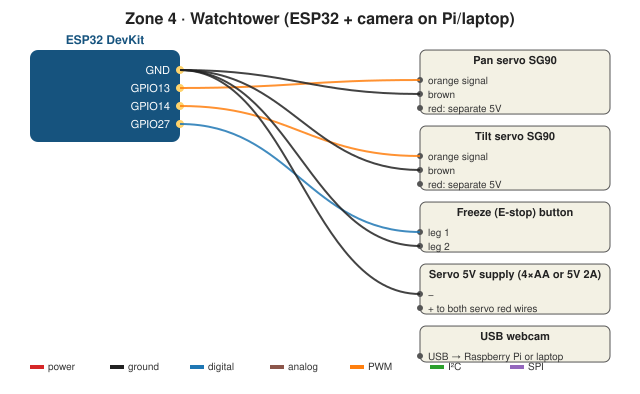

# Wiring (ESP32 servos + camera on the Pi)

## Parts
ESP32 DevKit · 2 × SG90 servos · pan/tilt bracket for SG90 · USB webcam (or Raspberry Pi camera) · separate 5 V supply for servos (4×AA pack or 5 V 2 A adapter) · push button · jumper wires

## Pin map
| Part | Wire | ESP32 |
|---|---|---|
| Pan servo | orange / brown / red | **GPIO13** / GND / **separate 5 V +** |
| Tilt servo | orange / brown / red | **GPIO14** / GND / **separate 5 V +** |
| Freeze button | legs | **GPIO27** / GND |
| Servo supply | − | ESP32 GND (shared ground!) |
| Webcam | USB | Raspberry Pi or laptop (runs `pi/tower_camera.py`) |

## Rules
- ⚠️ Two servos can pull more current than the ESP32's USB can give. **Separate 5 V** for the servo red wires, shared GND.
- Find the safe angle range of your bracket with `01_servo_limits` first, then write it into `PAN_MIN/MAX`, `TILT_MIN/MAX` in both sketches.
- Leave enough slack in the camera cable for the full pan range.

## Cheat-sheet
| Part | Signal | Simple meaning |
|---|---|---|
| SG90 | PWM | Pulse length = angle (about 0.5–2.4 ms) |
| Webcam | USB video | The Pi reads frames; OpenCV turns them into arrays of pixels |
| Proportional control | Software | Move more when the ball is far from centre, less when close |
