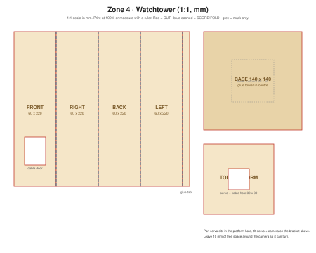

# Cardboard: watchtower

1:1 scale (mm). Print at 100% on A3, or copy the measurements.

## Design idea
A square tower, 220 mm tall, standing between the gate and the farm so the camera can see both. The **pan servo** sits in the top platform; the **tilt servo** and webcam sit on the pan/tilt bracket above it. The ESP32 hides inside the tower, reached through the cable door.

## Parts and cut list
| Part | Size (mm) | Qty | Notes |
|---|---|---|---|
| Tower body | 4 × 60 × 220 + 10 mm glue tab | 1 | Score 4 lines, fold into a square tube |
| Base | 140 × 140 | 1 | Heavy base so the tower doesn't tip |
| Top platform | 100 × 100 | 1 | 30 × 30 hole for the pan servo + cables |

## Build steps
1. Cut the tower strip, score the fold lines, cut the cable door on the FRONT panel.
2. Fold into a square tube, glue the tab.
3. Glue the tower to the centre of the base. Add a few coins or a stone inside the base corner for weight.
4. Glue the platform on top. Fix the pan servo in the hole (servo tabs on the platform).
5. Screw the bracket to the pan servo, tilt servo + camera on top.
6. Run cables down inside the tower.

## Demo checks
- [ ] The tower doesn't tip when the camera turns fast
- [ ] The camera can see the gate and the farm
- [ ] Cables don't pull at the limits of the pan range
