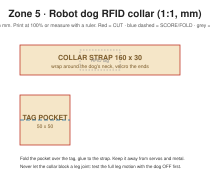

# Cardboard: RFID collar for the robot dog

1:1 scale (mm).

A light cardboard (or felt) strap that carries an RFID tag on the dog's neck, so the gate opens for the dog like it does for the rover.

| Part | Size (mm) | Notes |
|---|---|---|
| Collar strap | 160 × 30 | Velcro both ends |
| Tag pocket | 50 × 50 | Fold over the tag, glue to the strap |

## Checks
- [ ] With the dog **switched off**, move every leg and the head through their full range: the collar never blocks a joint
- [ ] The collar is not near a servo horn or the battery wires
- [ ] The gate reader reads the tag at the height the dog passes
