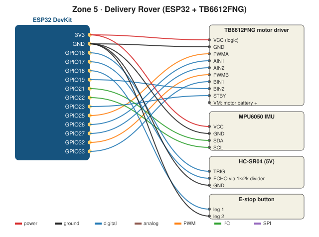

# Wiring (ESP32 + TB6612FNG motor driver)

## Parts
2WD robot car chassis (2 TT motors + wheels + caster) · TB6612FNG motor driver (or L298N, see below) · ESP32 DevKit · MPU6050 IMU module · HC-SR04 ultrasonic · 1 kΩ + 2 kΩ resistors · push button (E-stop) · motor battery pack (4×AA = 6 V) · USB power bank for the ESP32 · mini breadboard · RFID tag sticker

## Pin map
| Part | Pin on part | ESP32 |
|---|---|---|
| TB6612FNG | VCC (logic) / GND | 3V3 / GND |
| | PWMA / AIN1 / AIN2 (LEFT motor) | **GPIO25 / GPIO26 / GPIO27** |
| | PWMB / BIN1 / BIN2 (RIGHT motor) | **GPIO32 / GPIO33 / GPIO19** |
| | STBY | **GPIO23** |
| | VM / GND | Motor battery + / − |
| | AO1, AO2 / BO1, BO2 | Left motor / right motor |
| MPU6050 | VCC / GND / SDA / SCL | 3V3 / GND / **GPIO21 / GPIO22** |
| HC-SR04 | VCC / GND | **5V (VIN)** / GND |
| | TRIG | **GPIO16** |
| | ECHO → 1 kΩ → GPIO17, and GPIO17 → 2 kΩ → GND | **GPIO17** (≈3.3 V) |
| E-stop button | legs | **GPIO18** / GND |

All grounds connected together: ESP32 GND, driver GND, battery −.

## Rules
- ⚠️ **Wheels off the ground** for every first test of new code.
- ⚠️ Motors take power from the **motor battery**, never from an ESP32 pin.
- ⚠️ HC-SR04 ECHO is 5 V. The 1 kΩ / 2 kΩ divider brings it down to about 3.3 V.
- Using an **L298N** instead? Same pins (ENA = PWMA, IN1/IN2 = AIN1/AIN2, ENB = PWMB, IN3/IN4 = BIN1/BIN2), no STBY. It wastes about 2 V, so use 6×AA.

## Cheat-sheet
| Part | Signal | Simple meaning |
|---|---|---|
| Motor driver (H-bridge) | PWM + 2 direction pins | Small signals switch big motor current, both directions |
| MPU6050 IMU | I²C | Measures gravity direction → tilt angle |
| HC-SR04 | Digital pulse | Sends a click of sound, times the echo |
