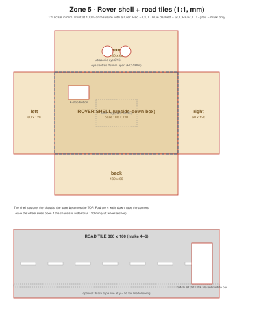

# Cardboard: rover shell + road tiles

1:1 scale (mm). Print at 100% on A3, or copy the measurements.

## Rover shell
An upside-down box that sits over the chassis, like a delivery van.
- Two "eye" holes on the front for the HC-SR04 (centres 26 mm apart).
- E-stop button on the top, easy to hit.
- RFID tag stuck **inside the top**, the side that passes over the gate's reader. Adjust if your reader is on the gate wall: then stick the tag on the side facing the wall.

| Part | Size (mm) | Notes |
|---|---|---|
| Shell top | 180 × 120 | E-stop hole, tag area |
| Front / back | 180 × 60 | Front: 2 × Ø16 eyes |
| Sides | 60 × 120 | Cut wheel arches if needed |

## Road tiles
Make 4–6 tiles of 300 × 100 mm and lay them from the gate to the farm. Draw the white centre dashes. One tile gets a white **gate stop line** where the rover waits for the gate to open. Optional: a black tape line along the middle for line following (v8).

## Build steps
1. Measure your chassis first and change the shell size if needed.
2. Cut the net, eyes and E-stop hole. Fold the walls down, tape the corners.
3. Fix the HC-SR04 behind the eyes, the button through the top.
4. The shell should lift off easily (velcro), so you can reach the battery.

## Demo checks
- [ ] The shell doesn't touch the wheels
- [ ] The ultrasonic eyes aren't blocked by cardboard edges
- [ ] The gate reader can read the tag from the stop line
