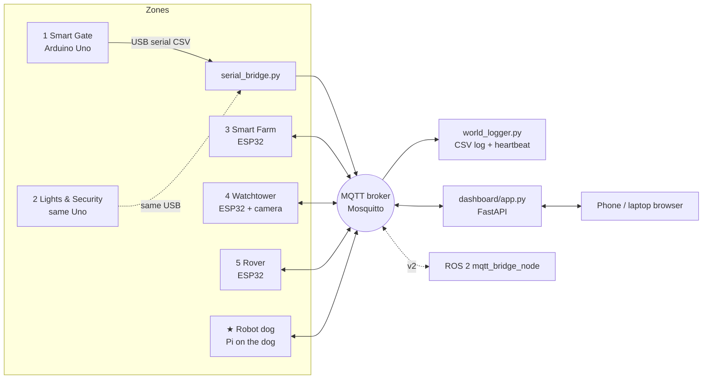

# Architecture

## Message rules
- Topic names: `world/<zone>/<thing>`. Commands: `world/cmd/<zone>`.
- The E-stop `world/estop` is **retained**: a device that reconnects gets the current value at once.
- The hub sends `world/hub/heartbeat` every second. No heartbeat = zones go safe.
- Moving robots stop 1 s after the last command. The dashboard re-sends while you hold a button.
