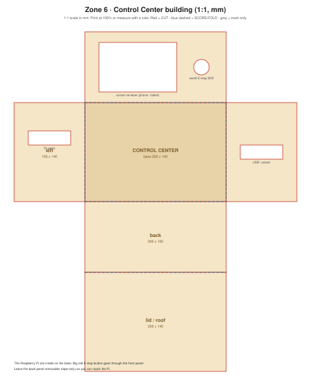

# Cardboard: Control Center building

1:1 scale (mm). Print at 100% on A3, or copy the measurements.

## Design idea
The world's "headquarters": a box that holds the Raspberry Pi, a window for an old phone or tablet showing the dashboard, and a **big red world E-stop button** on the front.

| Part | Size (mm) | Notes |
|---|---|---|
| Box net | 200 × 140 × 100 + lid | Screen window 110 × 70, E-stop hole Ø22 |
| Left wall | 100 × 140 | Vent slots for the Pi |
| Right wall | 100 × 140 | USB / power opening |

## Physical world E-stop (optional upgrade)
Wire a big latching mushroom button to a Pi GPIO pin and publish `world/estop true` when pressed. Until then, the dashboard button is the world E-stop.

## Build steps
1. Cut the net, the screen window, E-stop hole and vents.
2. Fold and tape; keep the **back panel taped only** so you can reach the Pi.
3. Pi on the base, cables out through the right wall.

## Checks
- [ ] The Pi has air around it (vents not blocked)
- [ ] The E-stop is the easiest thing to reach on the whole world board
