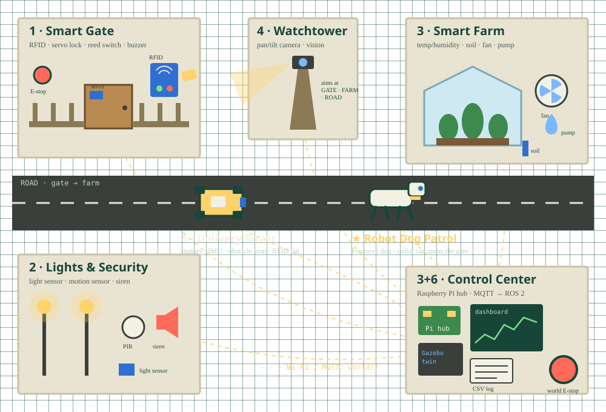

# 🌍 Mini Smart World

A tabletop robotics world, built one zone at a time. Every zone is a small finished project that **plugs into the zones built before it**. At the end, the whole world runs together and a Freenove robot dog patrols it.



## Zones

| # | Zone | Folder | Weeks | What you learn | Connects to |
|---|---|---|---|---|---|
| 1 | **Smart Gate** (RFID door) | [`1_smart_gate`](1_smart_gate/) | 1–3 | Pins, RFID, servo, buzzer, state machine, E-stop | The start |
| 2 | **Lights & Security** | [`2_lights_security`](2_lights_security/) | 4–5 | Light + motion sensors, PWM, alarms | Good card → welcome lights; forced gate → alarm |
| 3 | **Smart Farm** | [`3_smart_farm`](3_smart_farm/) | 6–8 | Temp/soil sensors, calibration, fan/pump | First zone on Wi‑Fi; reports to the Control Center |
| 4 | **Watchtower** | [`4_watchtower`](4_watchtower/) | 9–10 | Pan/tilt servos, camera, OpenCV | Turns to the gate on card scan or alarm, saves a photo |
| 5 | **The Road** (rover + dog) | [`5_the_road`](5_the_road/) | 11–14, 18–21 | Motors, IMU, obstacle stop, remote driving | Gate opens for the rover's and dog's RFID tags |
| 6 | **Control Center** | [`6_control_center`](6_control_center/) | 6–8, 15–17 | Raspberry Pi hub, MQTT, dashboard, logs, ROS 2, Gazebo | Every zone reports here; one world E-stop |

Shared code (message format, MQTT helpers) lives in [`common/`](common/).

## Build progress

- [ ] Zone 1 · Smart Gate
- [ ] Zone 2 · Lights & Security
- [ ] Zone 3 · Smart Farm + Control Center v1 (hub, dashboard, log)
- [ ] Zone 4 · Watchtower
- [ ] Zone 5 · Delivery Rover on the road
- [ ] Zone 6 · Control Center v2 (ROS 2 + Gazebo twin)
- [ ] ⭐ Robot dog patrol

## How the zones talk

Each zone runs on an **ESP32** (a small Wi‑Fi microcontroller). The **Raspberry Pi** in the Control Center is the hub. Zones send messages with **MQTT**: a device *publishes* to a named *topic* and anyone *subscribed* to it receives the message (ROS 2 uses the same idea).

```text
world/gate/state        LOCKED | UNLOCKED | OPEN | ALARM | EMERGENCY
world/gate/card         {"uid":"A1B2C3D4","allowed":true}
world/lights/state      ON | OFF | AUTO
world/security/alarm    true | false
world/farm/sensors      {"temp":24.1,"humidity":55,"soil":38}
world/farm/pump         ON | OFF
world/tower/event       {"photo":"...jpg","reason":"card_scan"}
world/rover/state       IDLE | DRIVING | BLOCKED | ESTOP
world/dog/state         IDLE | STANDING | MOVING | ESTOP
world/estop             true | false     <- ONE emergency stop for the whole world
world/cmd/<zone>        commands from the dashboard
```

Until Zone 3, zones run alone or talk over USB serial.

## Safety rules (every zone)

1. **World E-stop wins.** `world/estop = true` → every zone goes to its safe state.
2. **Silence means stop.** A zone that stops hearing from the hub goes safe on its own.
3. **Limits.** Max servo angle, motor speed and pump time.
4. **Log everything** with a timestamp.
5. **Manual first**, automatic later.

Hardware: ESP32 and Pi pins are **3.3 V**, never 5 V. Servos and motors get their own power supply (shared GND). Unplug before rewiring.

## Repo layout

```text
mini_smart_world/
├── README.md            ← you are here
├── assets/              ← world map, photos, wiring diagrams
├── common/              ← shared message format + helpers
├── 1_smart_gate/
├── 2_lights_security/
├── 3_smart_farm/
├── 4_watchtower/
├── 5_the_road/
└── 6_control_center/
```

Each zone folder has its own README with parts, versions (v1, v2, …), a checkpoint and notes. Inside a zone:

```text
<zone>/
├── README.md
├── firmware/      ← ESP32 Arduino sketches (one folder per version: v1_..., v2_...)
├── pi/            ← Python code for the Raspberry Pi (if any)
├── wiring/        ← diagrams, Tinkercad links, photos
└── notes/         ← lab notebook: what you built, what broke, what you learned
```

Commit after every version: `git add . && git commit -m "gate v3: allowed card list" && git push`

## Related

- Freenove Dog Lab Companion (web dashboard + backend for the robot dog), joins as the final zone.
