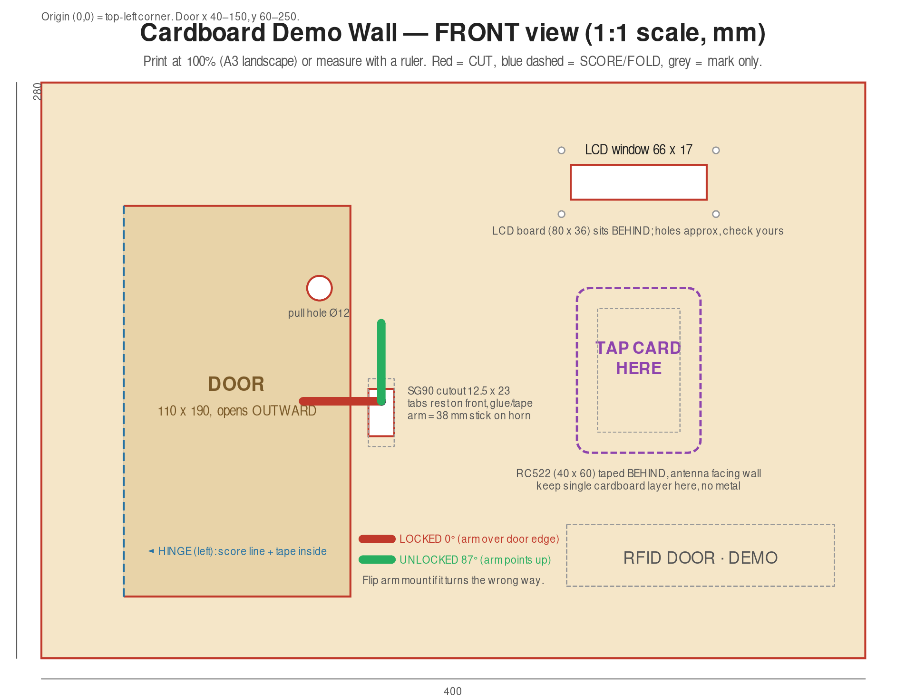
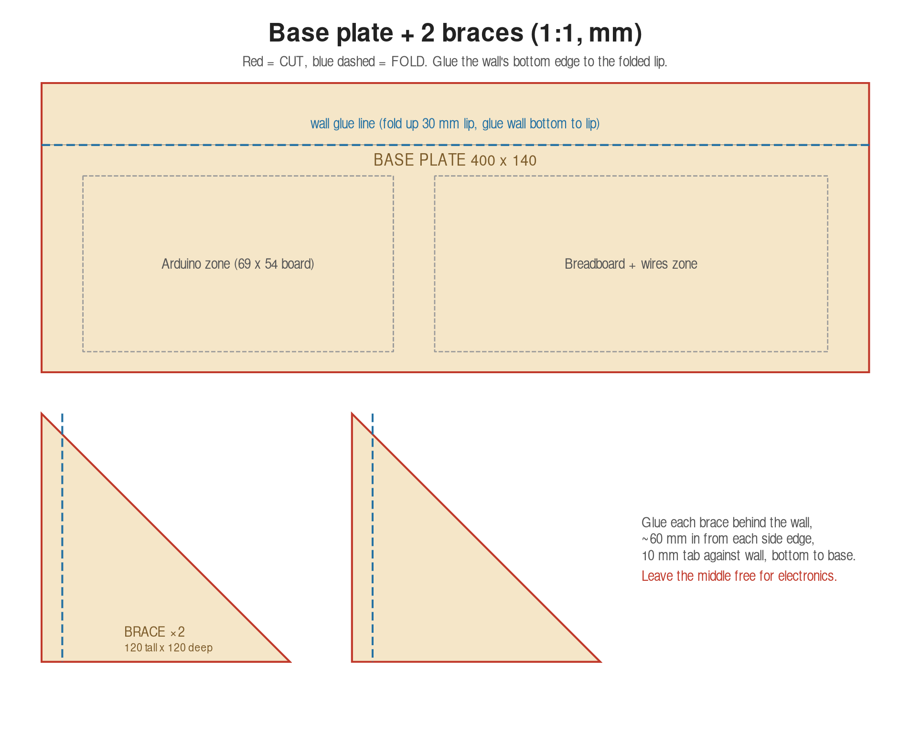

# Cardboard Demo Wall (door + wall + stand)

Both drawings are 1:1 scale (mm). Print at 100% on A3, or copy the measurements with a ruler.

## Design idea
A freestanding wall with a hinged door. The SG90 servo sits on the **front**, next to the door, with a 38 mm arm:
- **Locked (0°):** arm lies over the door edge, so the door can't open.
- **Unlocked (87°):** arm points up, door can be pulled open.
- All electronics (Arduino, breadboard, RC522, LCD) hide **behind** the wall, so the audience sees only the door, LCD window and "TAP CARD HERE".

## Parts and cut list
| Part | Size (mm) | Qty | Notes |
|---|---|---|---|
| Wall panel | 400 x 280 | 1 | Cut door on 3 sides, LCD window, servo slot |
| Base plate | 400 x 140 | 1 | Fold a 30 mm lip, glue wall to lip |
| Braces | 120 tall x 120 deep (right triangle + 10 mm tab) | 2 | Glue ~60 mm in from each side edge |
| Lock arm | 38 x 8 | 1 | Cardboard strip or craft stick, fixed to servo horn |

Use single-wall cardboard about 3 mm thick (shipping box). Tools: ruler, pencil, craft knife, cutting mat, hot glue or strong tape, double-sided tape.

## Key positions on the wall (origin = top-left)
| Item | Position / size |
|---|---|
| Door | x 40–150, y 60–250 (110 x 190), hinge on LEFT edge, opens outward |
| Pull hole | centre (135, 100), Ø12 |
| Servo cutout | x 158.75–171.25, y 149–172 (12.5 x 23); shaft at (165, 155) |
| LCD window | x 257–323, y 40–57 (66 x 17) |
| RFID tap zone | x 260–320, y 100–180; RC522 taped behind at x 270–310, y 110–170 |

## Build steps
1. **Mark** every shape on the wall panel with ruler and pencil (or tape the printout on and trace with a pin).
2. **Cut** the door on 3 sides (top, right, bottom) with the knife. Score the left (hinge) line lightly. Don't cut through.
3. **Cut** the LCD window and servo slot. Test-fit the servo from the front.
4. **Tape the door hinge** on the inside with strong tape. Check it swings freely outward.
5. **Mount the servo** from the front: tabs rest on the surface, secure with hot glue or tape. Attach the 38 mm arm to the horn.
6. **Mount behind the wall:** LCD (screen facing the window), RC522 (antenna side against the cardboard, centred on the tap zone).
7. **Build the stand:** fold the base lip, glue the wall to it, then glue the two braces to wall and base.
8. **Wire** as in `docs/wiring.md`, with the USB cable running out the back.
9. **Calibrate:** with the sketch running, check 0° lets the arm block the door and 87° clears it. If the arm moves the wrong way, rotate the horn or change the two angles in `02_door_access.ino`.

## Demo checks
- [ ] Door is blocked when locked (try pulling it)
- [ ] Door opens freely when unlocked
- [ ] Card tap works through the cardboard from 0–3 cm
- [ ] LCD readable through the window
- [ ] Wall doesn't tip when the door is pulled
- [ ] Servo arm can't trap a finger: keep fingers away while it moves

## Notes
- The LCD hole spacing and servo tab size are approximate. Measure your own modules and adjust.
- Keep metal (screws, foil) away from the RC522 area, since it weakens the card signal.
